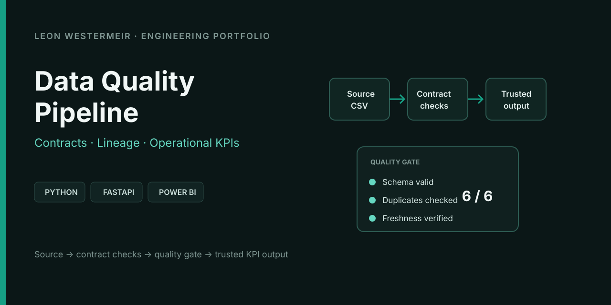
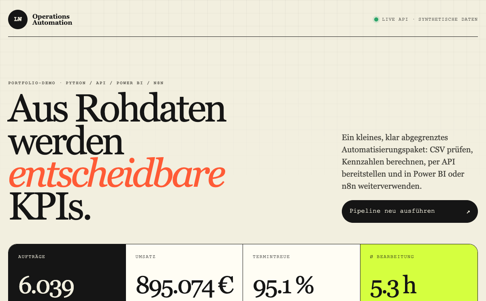
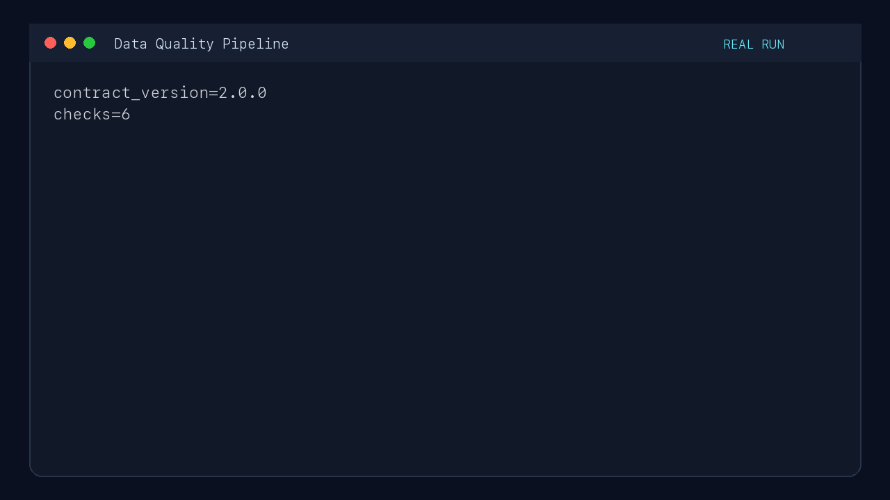
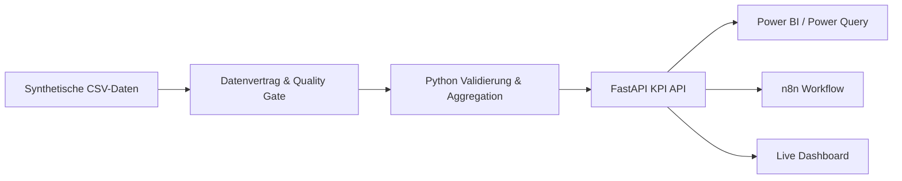

# Operations KPI Automation – Python / API / Power BI Demo

Portfolio-MVP für ein typisches kleines Automatisierungspaket: operative
CSV-Daten werden validiert, mit Python zu belastbaren KPIs verdichtet und über
eine FastAPI-Schnittstelle für Power BI, n8n oder andere Systeme bereitgestellt.

Die Demo nutzt ausschließlich synthetische Daten.

[](https://github.com/leonwwest/operations-kpi-automation-demo/actions/workflows/tests.yml)
[](https://github.com/leonwwest/operations-kpi-automation-demo/actions/workflows/security.yml)
[](https://operations-kpi-automation-demo.vercel.app)





**Direkt ausprobieren:** [operations-kpi-automation-demo.vercel.app](https://operations-kpi-automation-demo.vercel.app)

**Kurzer Browser-Rundgang:** [Portfolio-Video ansehen](portfolio-demo.mp4)

## Recruiter-Kurzüberblick

| Frage | Nachweis im Repository |
|---|---|
| Was wird automatisiert? | CSV-Validierung, Quality Gate, KPI-Aggregation und API-Bereitstellung |
| Wie wird Datenqualität belegt? | Versionierter Vertrag, sechs Prüfungen, Quarantäne, SHA-256 und Lineage |
| Wer konsumiert das Ergebnis? | Live-Dashboard, Power BI/Power Query und ein importierbarer n8n-Workflow |
| Wie wird es geprüft? | 27 Tests, sechs reale Quality Checks, CodeQL, Dependency Audit, Trivy und SPDX-SBOM |
| Wo sind die Grenzen? | Synthetische Daten und klar dokumentierte Produktionsanforderungen |

### Echter Ausführungsnachweis

Die folgende Aufnahme basiert auf der realen `/api/quality`-Antwort und dem echten Testlauf. Sie zeigt den beobachteten Gate-Status, Score und alle sechs Qualitätsprüfungen – keine generierte Dashboard-Attrappe.



## Was die Demo zeigt

- reproduzierbare CSV-Validierung ohne versteckte manuelle Schritte
- versionierter Datenvertrag mit Ownership, Business Key und erwarteter Lieferperiode
- sechsdimensionales Quality Gate für Vollständigkeit, Validität, Eindeutigkeit und Aktualität
- SHA-256-basierte Source-Evidenz und abrufbare End-to-End-Lineage
- fehlerhafte Zeilen (u. a. verkürzte Zeilen, NaN/Infinity, Regelverletzungen)
  werden quarantänisiert und im Quality-Block der API gemeldet, statt den Lauf
  abzubrechen
  ([`data/operations-broken.csv`](data/operations-broken.csv) zum Ausprobieren)
- KPI-Berechnung für Aufträge, Umsatz, Termintreue, Bearbeitungszeit und
  Störungen über 12 Monate und drei Teams
- REST-API mit typisierten Response-Modellen, Healthcheck, Ergebnisabruf und
  simuliertem Refresh inkl. Lauf-Protokoll
- interaktives Management-Dashboard mit Zielwert-Ampel und Trend-Indikator
- Power-Query-M-Vorlage und DAX-Beispielkennzahlen
- importierbarer n8n-Workflow: täglicher Schedule-Trigger, Refresh-Aufruf und
  getrennte Status-/Fehlermeldung
- automatisierte Tests und GitHub Actions



## Schnellstart

```bash
python3 -m venv .venv
source .venv/bin/activate
pip install -r requirements.txt
uvicorn app.main:app --reload --port 8001
```

Danach:

- Dashboard: http://127.0.0.1:8001
- API-Dokumentation: http://127.0.0.1:8001/docs
- KPI-Endpunkt: http://127.0.0.1:8001/api/kpis
- Quality Gate: http://127.0.0.1:8001/api/quality
- Lineage: http://127.0.0.1:8001/api/lineage

## Tests

```bash
pytest -q
```

## Datenvertrag und Betrieb

- [`data/contract.json`](data/contract.json): versionierter Producer-/Consumer-Vertrag
- [`docs/data-contract.md`](docs/data-contract.md): Regeln, Dimensionen und Gate-Semantik
- [`docs/operations-runbook.md`](docs/operations-runbook.md): Refresh, Fehleranalyse und Recovery

Jeder API-Lauf weist Vertragsversion und SHA-256 der Quelldatei aus. Dadurch lässt sich belegen,
welcher Input zu einem KPI-Ergebnis geführt hat, ohne Rohdaten in Logs zu kopieren.

## Power BI

Unter [`powerbi/operations-kpi-query.m`](powerbi/operations-kpi-query.m) liegt
eine Power-Query-Abfrage für die Live-API. Beispielkennzahlen stehen in
[`powerbi/measures.dax`](powerbi/measures.dax).

## n8n

[`workflows/n8n-kpi-refresh.json`](workflows/n8n-kpi-refresh.json) kann direkt
in n8n importiert werden. Der Workflow läuft täglich um 06:00 Uhr, ruft den
Refresh-Endpunkt der Live-Demo auf, prüft das Ergebnis und bereitet je nach
Ausgang eine kompakte Status- oder Fehlermeldung vor.

## Abgrenzung

Die Demo nutzt weiterhin synthetische CSV-Daten und eine In-Memory-Verarbeitung. Sie zeigt den
entscheidenden Produktionspfad – Vertrag, Quarantäne, Quality Gate, Lineage und Runbook – ohne
eine echte ERP-Verbindung vorzutäuschen. In einer Produktionsumsetzung würden persistente
Run-Metadaten, Authentifizierung, fachliche KPI-Freigabe, Monitoring und ein abgestimmtes
Berechtigungskonzept ergänzt.

## Lizenz

MIT
