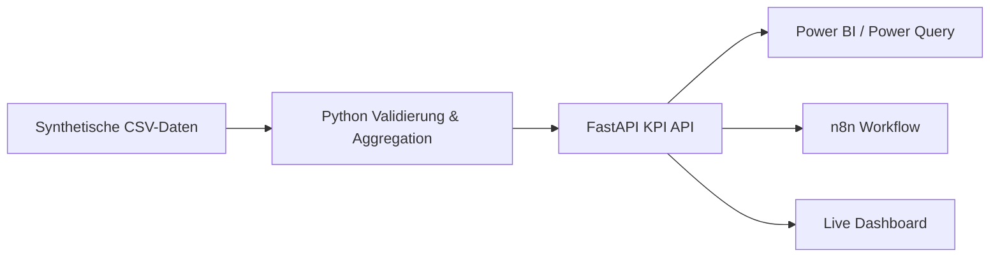

# Operations KPI Automation – Python / API / Power BI Demo

Portfolio-MVP für ein typisches kleines Automatisierungspaket: operative
CSV-Daten werden validiert, mit Python zu belastbaren KPIs verdichtet und über
eine FastAPI-Schnittstelle für Power BI, n8n oder andere Systeme bereitgestellt.

Die Demo nutzt ausschließlich synthetische Daten.


## Was die Demo zeigt

- reproduzierbare CSV-Validierung ohne versteckte manuelle Schritte
- KPI-Berechnung für Aufträge, Umsatz, Termintreue und Bearbeitungszeit
- REST-API mit Healthcheck, Ergebnisabruf und simuliertem Refresh
- interaktives Management-Dashboard
- Power-Query-M-Vorlage und DAX-Beispielkennzahlen
- importierbarer n8n-Workflow für einen automatisierten Refresh
- automatisierte Tests und GitHub Actions



## Schnellstart

```bash
python3 -m venv .venv
source .venv/bin/activate
pip install -r requirements.txt
uvicorn app.main:app --reload --port 8001
```

Danach:

- Dashboard: http://127.0.0.1:8001
- API-Dokumentation: http://127.0.0.1:8001/docs
- KPI-Endpunkt: http://127.0.0.1:8001/api/kpis

## Tests

```bash
pytest -q
```

## Power BI

Unter [`powerbi/operations-kpi-query.m`](powerbi/operations-kpi-query.m) liegt
eine Power-Query-Abfrage für die API. Beispielkennzahlen stehen in
[`powerbi/measures.dax`](powerbi/measures.dax).

## n8n

[`workflows/n8n-kpi-refresh.json`](workflows/n8n-kpi-refresh.json) kann direkt
in n8n importiert werden. Der Workflow ruft den Refresh-Endpunkt auf, prüft das
Ergebnis und bereitet eine kompakte Statusmeldung vor.

## Abgrenzung

Die Demo ist ein bewusst kleines, vorführbares Arbeitspaket. In einer
Produktionsumsetzung würden Datenbank-/ERP-Anbindung, Authentifizierung,
fachliche KPI-Freigabe, Monitoring und ein abgestimmtes Berechtigungskonzept
ergänzt.

## Lizenz

MIT
