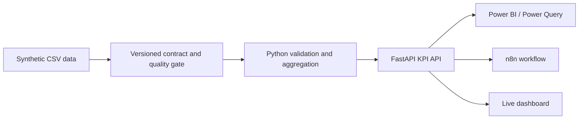

# Operations Data Quality Pipeline

A production-shaped portfolio lab that validates synthetic operations data, calculates management KPIs in Python, and publishes traceable results through FastAPI for Power BI and n8n.

[](https://github.com/leonwwest/operations-kpi-automation-demo/actions/workflows/tests.yml)
[](https://github.com/leonwwest/operations-kpi-automation-demo/actions/workflows/security.yml)
[](https://operations-kpi-automation-demo.vercel.app)

[Live dashboard](https://operations-kpi-automation-demo.vercel.app) · [API documentation](https://operations-kpi-automation-demo.vercel.app/docs) · [Recorded walkthrough](portfolio-demo.mp4)


## 60-second recruiter view

| | Evidence |
|---|---|
| **Problem** | Turn operational CSV input into trustworthy, consumable KPIs without silently accepting malformed data. |
| **Python pipeline** | Schema and business-rule validation, row quarantine, six contract checks, KPI aggregation by team and month. |
| **API and lineage** | Typed FastAPI responses for KPIs, quality evidence, SHA-256 source lineage, health, and refresh traces. |
| **Business consumers** | Interactive dashboard, a working Power Query connector, DAX measures, and an importable scheduled n8n workflow. |
| **Verification** | 27 passing tests plus CodeQL, dependency audit, Trivy scanning, and SPDX SBOM generation in GitHub Actions. |
| **Scope** | Uses synthetic CSV data and in-memory processing; production gaps are stated explicitly below. |


## Execution evidence

This recording is driven by the real `/api/quality` response and the repository's test suite. It shows the observed gate status, quality score, and all six checks.


The checked-in broken sample, [`data/operations-broken.csv`](data/operations-broken.csv), exercises quarantine behavior for malformed rows, non-finite values, and business-rule violations.

## Architecture



### What the implementation demonstrates

- **Data quality:** a versioned contract defines ownership, the business key, the reporting period, allowed teams, and thresholds. Six checks cover volume, period coverage, rejected-row rate, uniqueness, domain validity, and freshness.
- **Failure handling:** invalid rows are quarantined with line-level messages instead of terminating the complete load. The gate result remains visible in every KPI response.
- **KPI logic:** Python aggregates orders, revenue, on-time rate, weighted processing time, and incidents for the total dataset, three teams, and twelve months.
- **Traceability:** each run exposes the contract version and SHA-256 of the source file; `/api/lineage` maps the source through validation and aggregation to the API and Power BI consumer.
- **API design:** FastAPI and Pydantic provide typed models for `/api/kpis` and `/api/refresh`; additional endpoints expose health, quality checks, and lineage.
- **Automation:** the n8n definition schedules a daily 06:00 refresh, checks the API result, and prepares separate success and failure messages.
- **Delivery controls:** pull requests run pytest and a security workflow with CodeQL, `pip-audit`, Trivy, and SPDX SBOM generation.

## Evidence map

| Capability | Repository evidence |
|---|---|
| Validation and quarantine | [`app/pipeline.py`](app/pipeline.py), [`tests/test_pipeline.py`](tests/test_pipeline.py) |
| Contract checks and lineage | [`app/data_quality.py`](app/data_quality.py), [`data/contract.json`](data/contract.json), [`docs/data-contract.md`](docs/data-contract.md) |
| FastAPI endpoints and typed responses | [`app/main.py`](app/main.py), [`tests/test_api.py`](tests/test_api.py) |
| Power BI integration | [`powerbi/operations-kpi-query.m`](powerbi/operations-kpi-query.m), [`powerbi/measures.dax`](powerbi/measures.dax) |
| n8n orchestration | [`workflows/n8n-kpi-refresh.json`](workflows/n8n-kpi-refresh.json) |
| Operational recovery | [`docs/operations-runbook.md`](docs/operations-runbook.md) |
| CI and supply-chain controls | [Tests workflow](.github/workflows/tests.yml), [Security workflow](.github/workflows/security.yml) |

## Run locally

```bash
python3 -m venv .venv
source .venv/bin/activate
pip install -r requirements.txt
uvicorn app.main:app --reload --port 8001
```

Open the dashboard at `http://127.0.0.1:8001`, the API documentation at `http://127.0.0.1:8001/docs`, or query:

- `GET /api/kpis`
- `GET /api/quality`
- `GET /api/lineage`
- `POST /api/refresh`

Run the test suite with:

```bash
pytest -q
```

## Production boundaries

This lab intentionally uses synthetic CSV input and in-memory processing; it does not claim a live ERP integration. A production implementation would add persistent run metadata, authentication and authorization, business ownership of KPI definitions, monitoring and alerting, and an agreed release process for contract changes.

## License

MIT
